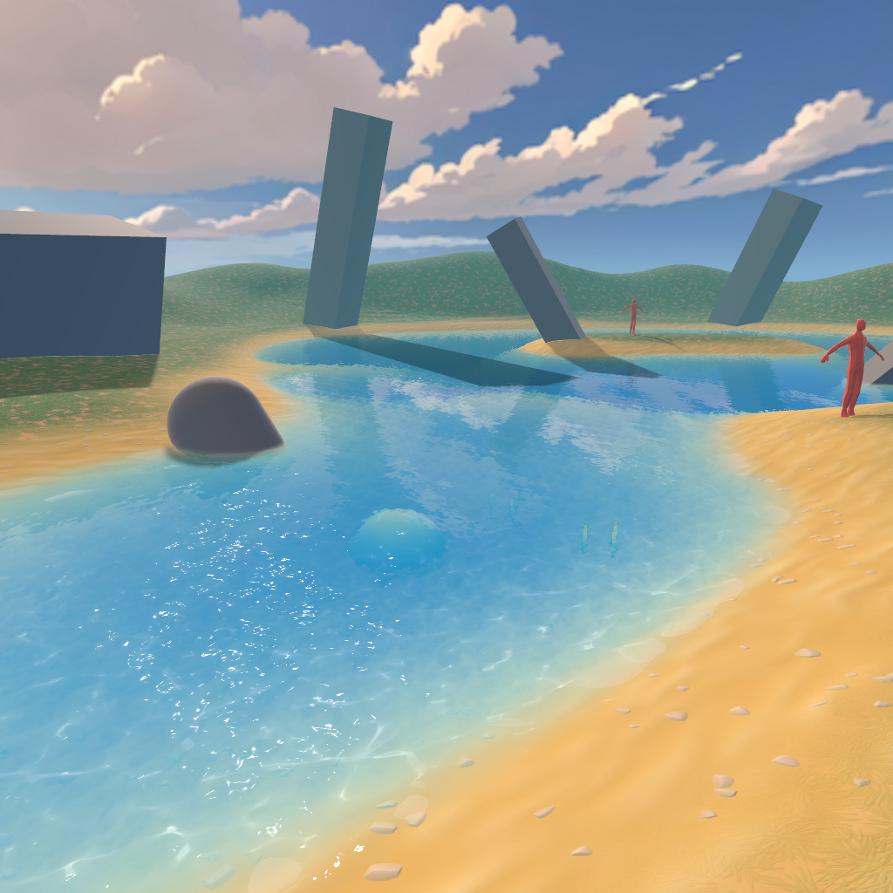

# Uber Stylized Water — three.js WebGPU (TSL) Port

This is a **three.js r185 WebGPU + TSL** port of
[Uber Stylized Water](https://github.com/MatrixRex/Uber-Stylized-Water) (MIT / © 2025 MatrixRex),
a stylized water shader for Unity URP. The demo scene also recreates the Unity version.

**[Open the live demo](https://norio.github.io/three-stylized-water/)**



## Getting Started

Requires Node.js 22.16 or newer and npm 11.10 or newer.

```bash
npm install
npm run dev            # http://localhost:5180
```

- The main page is the water demo. The [lil-gui](https://lil-gui.georgealways.com/) parameter UI is shown by default. Rendering normally runs at 30fps while idle and 60fps during camera interaction.
- Retina displays retain DPR 2 on small screens, while large screens limit the drawing buffer to 4 million pixels.
- `?hud=0` … Hides the lil-gui parameter UI. The standard UI is not connected to the render loop and updates uniforms only during interaction.
- `?profile=1` … Additionally displays the three.js Profiler for GPU diagnostics. It collects GPU timestamps for all passes,
  so leave it disabled for performance comparisons.

## Implemented Features (1:1 with the Unity Version)

| Feature | Files |
|---|---|
| Depth-based water color (shallow/deep, world-space exponential falloff) and shore fade | `src/water/nodes/depth.ts`, `baseColor.ts` |
| Gerstner waves (two-wave composition, analytical normals, crest color) | `src/water/nodes/waves.ts` |
| Two-direction panning normal maps with distance blending | `src/water/nodes/normals.ts` |
| Stylized specular (Phong with Size/Hardness shaping) and shadow layer | `src/water/nodes/specular.ts` |
| Screen-space refraction with depth checks | `src/water/nodes/refraction.ts` |
| Parallax-based pseudo-projected caustics | `src/water/nodes/caustics.ts` |
| Surface foam and underwater layer (parallax) | `src/water/nodes/surfaceFoam.ts` |
| Intersection foam | `src/water/nodes/intersection.ts` |
| Animated shore waves (shoreline) | `src/water/nodes/shoreline.ts` |
| Planar reflections, environment probes, and Fresnel | `src/water/nodes/reflection.ts` |
| Final composition (layer order and alpha chain) | `src/water/WaterMaterial.ts` |

The eight presets from the Unity template materials (anime / clear / genshin / murky /
oldschool / tropical / wavy / wavy2) are extracted from the `.mat` files and used as-is
(`src/water/presets.json`).

## URL Parameters

| Parameter | Description |
|---|---|
| `preset`, `cam` | Preset and fixed camera pose |
| `hud=0` | Hides the lil-gui parameter UI shown by default |
| `profile=1` | Explicitly enables the three.js Profiler that collects GPU timestamps |
| `fps=60` | Sets a fixed rendering cap. If omitted, switches automatically between 30/60fps; `fps=0` removes the cap |
| `freeze=1&t=10` | Pauses animation and fixes the shader time |
| `on`, `off`, `set` | Diagnostic overrides for water uniforms |

## GitHub Pages

The included GitHub Actions workflow checks and builds the project before deploying `dist`
whenever `main` is pushed. In the repository settings, select **GitHub Actions** under
**Pages → Build and deployment → Source**. The relative Vite base supports both project Pages
URLs and custom domains without repository-specific configuration.

The demo targets a current browser with WebGPU support. GitHub Pages provides the secure HTTPS
context required by WebGPU.

## License

The original Uber Stylized Water is licensed under the MIT License (© 2025 MatrixRex).
The textures, meshes, and demo scene assets also come from the same repository.
This port is distributed under the same terms.
